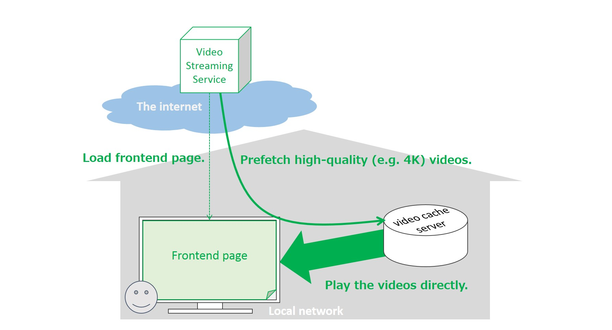
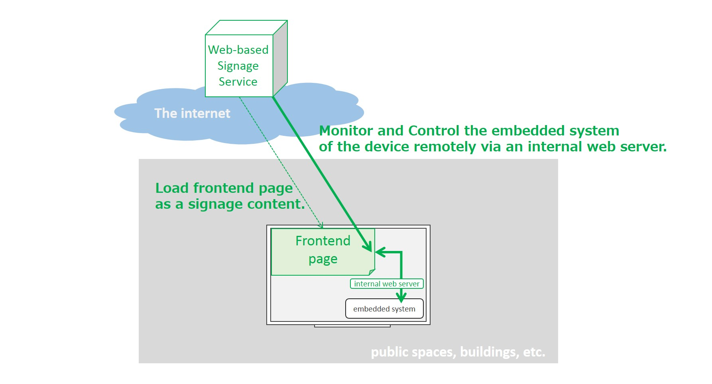
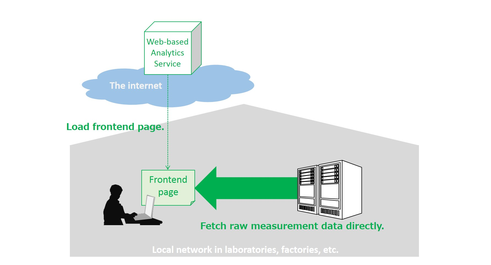
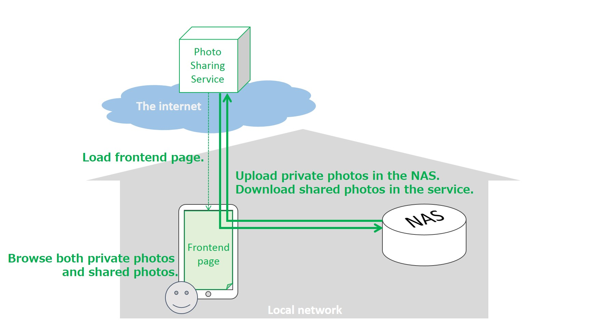

# Use Cases of HTTPS/WSS in Local Network

This document describes use cases where browsers communicate with web-server-capable devices in local network via HTTP and/or WebSocket over TLS.
These use cases are intended to clarify requirements in terms of network (topology, protocol, etc.) and security
(privacy concern, issuing a certificate, validation, etc.).

## UC-01: Access audio contents in a home storage device from a cloud service

Users can store their audio contents in their storage device, or set-top boxes, in their home.
They access online music web services with web browsers, and use a music player implemented as a web application
in the web services to play music stored in their home network.
The music player send metadata of the music to the web service, to recommend another music contents.

## UC-02: Video streaming with cache storage in local network

A user has a video cache server appliance in her home for enjoying high-quality (e.g. 4K) online video streaming services.
She enters an online video streaming service by using a browser on her TV. 
The streaming service finds her cache server appliance through the browser and shows her the appliance via a popup window.
She selects the appliance and allows the service to use it as cache storage for high-quality video streaming.
After her approval, the service can cache 4K movies purchased by her (or put into her watch-list, etc.) in the appliance.
The video caching can be done by the frontend of the service loaded on the browser or by the appliance itself. 
When she wants to watch one of the movies cached in the appliance, the online service fetch the movie from the appliance directly.
She can watch the movie comfortably (e.g. without causing stalls) regardless of the condition of the internet.

## UC-03: Web-based UI for home appliances (input/output constrained devices)

A user controls home appliances (e.g. air conditioner, microwave oven, refrigerator) with an online GUI service on the internet.
The home appliances are designed natively to be used via the online GUI loaded in a browser on her smartphone or tablet.
As with the use cases mentioned above, when she signs in to the online service, the service finds a home appliance through the browser.
Under her approval, the service can be granted access privileges for the appliance and she can control it through the GUI service.

## UC-04: Embedded system monitoring and controlling for display-capable devices

A field engineer of a digital signage service provider sets up an internet-capable display device.
The engineer makes the device display a specific website as a signage content by using a browser on the device.
After that, the website is monitoring the status of the embedded system (e.g. collecting logs, monitoring system resource utilization)
continuously via the browser by using internal REST APIs provided by an internal web server (e.g. https://localhost) of the device.
If the device provides the website with reboot functionality as one of the REST APIs, the service provider is able to not only check 
the health of the device, if necessary, but also reboot the device remotely via the website.

## UC-05: Data analysis from analytical and measuring instruments in local network

An analytical and measuring instrument in local network outputs a large amount of raw data as the result of an experiment.
An experimenter (a user of the instrument) signs in to a web-based analytical service provided by the vender of the instrument by using a browser in her PC.
The experimenter analyzes the raw data by using the web service and the service fetches the raw data from the instrument directly in local network.

## UC-06: Photo sharing between online services and home NAS devices

A user usually stores her private photos and videos in a home NAS device.
She opens an online photo sharing service in a browser on her smartphone.
The online service finds her home NAS device through the browser and shows her the NAS via a popup window.
She selects the NAS and the browser shows her private photos in the NAS as well as the ones already stored in the online service.
She then selects and posts some photos that she would like to share with her friends or, 
if she usually posts photos to the online service from her smartphone directly, she downloads the photos and posts them to the NAS device.

